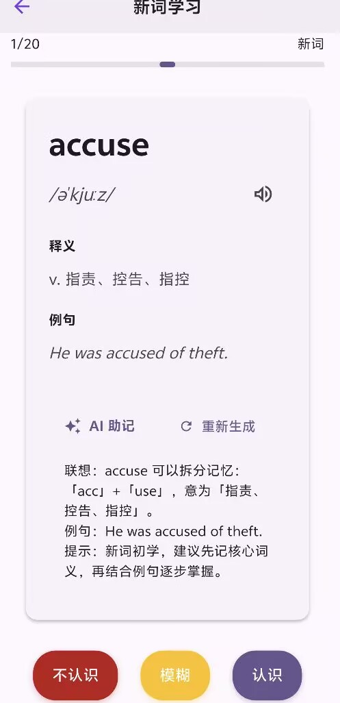
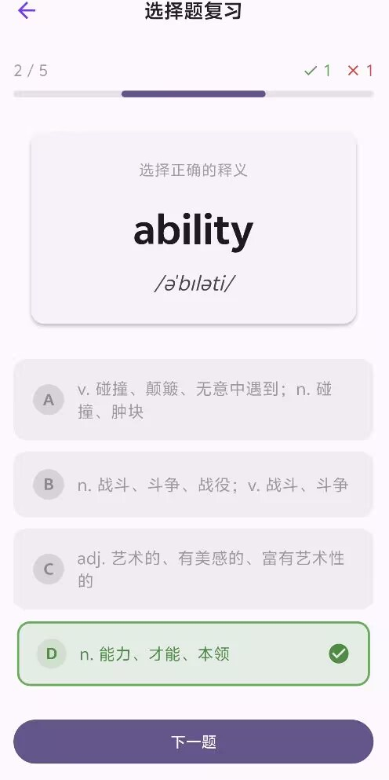
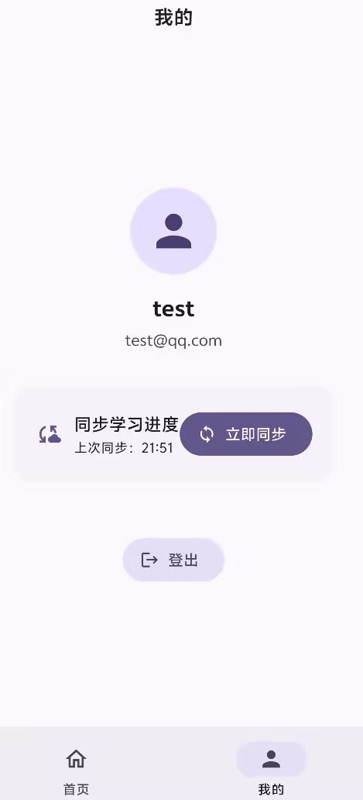

# memora

Flutter 单词背诵应用：基于 SM-2 间隔重复算法的多模式背单词 App，含 FastAPI 后端与云端学习记录同步。

## 功能预览

| 首页（今日任务 / 快速入口） | 新词学习（TTS + AI 助记 + SM-2 反馈） |
|:---:|:---:|
|  |  |
| **选择题复习** | **我的（登录状态 / 云端同步）** |
|  |  |

### （图片见 screenshots/，仅部分功能展示）

## 技术栈

**客户端（Flutter）**

- 状态管理：Riverpod（StateNotifierProvider）
- 本地持久化：Hive（auth / reviews / settings Box，按账号命名空间隔离）
- 网络：Dio（JWT 拦截器、401 自动登出、超时指数退避重试）
- 路由：go_router
- 数据模型：Freezed + JSON 序列化
- 依赖注入：get_it + injectable
- TTS：flutter_tts（单词发音、听音辨词）

**后端（backend/）**

- FastAPI + SQLAlchemy + SQLite
- JWT 认证（PyJWT + argon2 密码哈希）
- 启动自动建表并幂等 Seed CET-4 / CET-6 内置词库

## 主要功能

- **学习核心**：SM-2 间隔重复算法、今日复习队列、到期为空时回退"已学未到期"巩固练习
- **三种练习模式**：选择题、听音辨词、拼写复习（SM-2 映射评分，防重复提交）
- **词库**：CET-4 / CET-6 内置词库、多词库切换、用户自建词库、自建单词 CRUD、自建词库本地学习闭环（学新词 / 复习 / 三种练习）
- **AI 辅助**：学习卡片与单词详情页 AI 助记建议
- **TTS**：单词发音喇叭按钮，听音辨词模式语音播放
- **账户体系**：JWT 登录 / 注册、游客模式（杀进程重启可恢复）、多账号本地数据命名空间隔离
- **云端同步**：登录后自动同步学习记录，多设备冲突按 LWW（Last-Write-Wins）合并；个人中心可手动"立即同步"

## 产品边界

- **自建词库仅保存在本地**：自建词库与自建单词不参与云端同步，换设备不恢复。
- **云端学习记录同步主要面向内置词库**（CET-4 / CET-6）；同步按词库隔离，仅同步内置词库的复习记录。
- 连续打卡、社交等功能未实现，不在产品范围内。

## 运行方式

### 后端（backend/，Python ≥ 3.11）

> **部署说明（v1.0）**：当前版本**未部署云服务器**，登录注册、云端同步等网络功能均通过**本机运行 FastAPI** 演示——Android 模拟器经 `10.0.2.2`、真机经电脑局域网 IP 连接本机后端；游客模式与全部本地学习功能无需后端即可使用。如需临时外网访问，可用 `ngrok http 8000` 生成临时公网地址，再以 `--dart-define=API_BASE_URL=<ngrok地址>/api` 注入。

```bash
cd backend
pip install -e ".[dev]"          # 安装依赖（含 pytest 等开发依赖）
copy .env.example .env           # 复制环境变量配置（Windows；macOS/Linux 用 cp）
# 编辑 .env：JWT_SECRET 必填（可用 python -c "import secrets; print(secrets.token_urlsafe(32))" 生成）
uvicorn app.main:app --reload    # 启动，默认 http://localhost:8000
```

验证：

- 健康检查：`http://localhost:8000/health` → `{"status": "ok"}`
- 接口文档：`http://localhost:8000/docs`（Swagger UI）
- 业务接口统一前缀 `/api/v1`，首次启动自动建表并写入 CET-4 / CET-6 种子数据

### 客户端

```bash
flutter pub get
flutter run --flavor development --debug    # Android Studio 选 developmentDebug
```

API 地址（编译期 `--dart-define` 注入，不改源码）：

- Android 模拟器：`--dart-define=API_BASE_URL=http://10.0.2.2:8000/api`（10.0.2.2 映射宿主机 localhost）
- 真机调试：手机与电脑同一局域网，用电脑 LAN IP：
  `--dart-define=API_BASE_URL=http://<电脑IP>:8000/api`
- 不注入时 development 使用内置默认地址（模拟器/真机网络环境不同，建议按上两种方式显式注入）；staging / production 缺省注入会启动期报错

### 测试

```bash
flutter test           # 客户端：316 个单元 / 控制器测试
cd backend && pytest   # 后端：auth / words / records / ai / health
```
